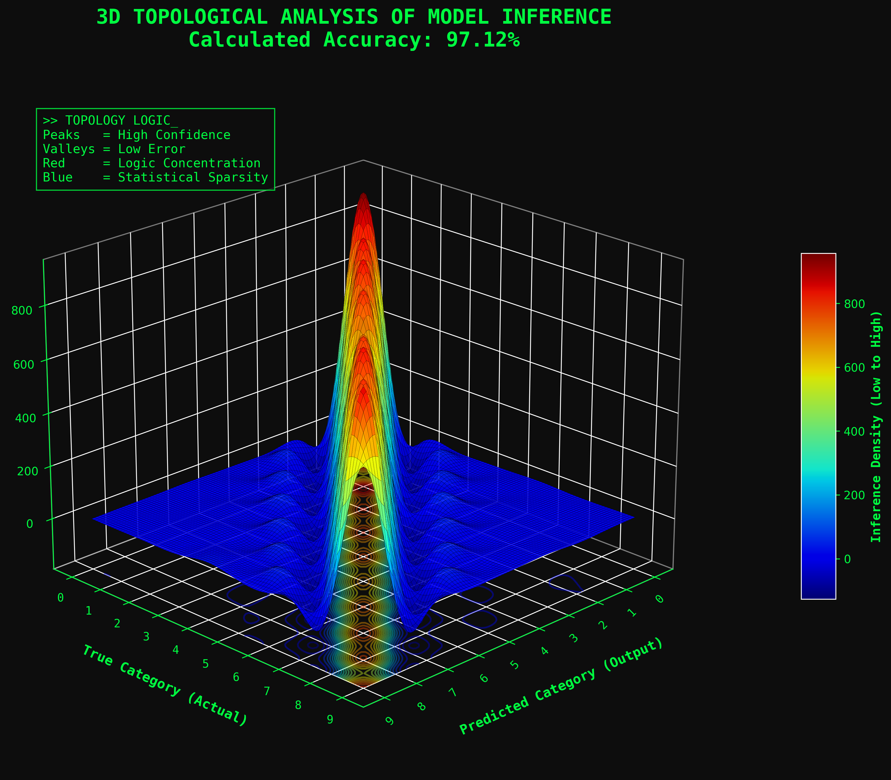
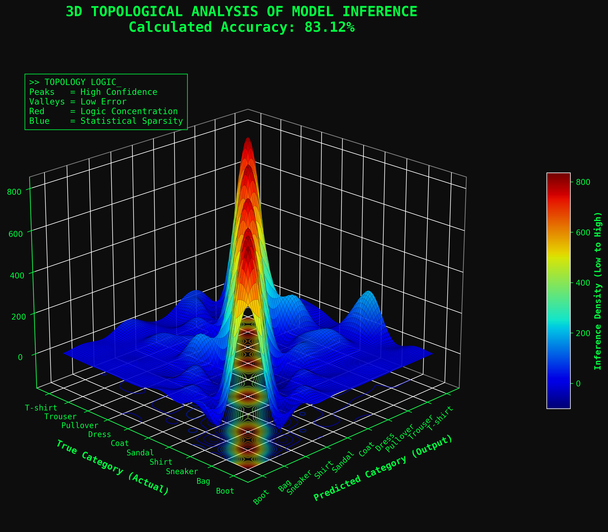

# 🧠 Cognitive Inference Complexity Lab

**Tech Stack:** Python, NumPy, SciPy, Matplotlib (3D), **Plotly (Interactive Web UI)**

---

## 📌 Project Overview
This repository explores the inference capabilities of a Multilayer Perceptron (MLP) built entirely from scratch. The primary goal of this research is not just to calculate accuracy metrics, but to **visualize how a neural network "thinks"** and how its cognitive confidence degrades when transitioning from simple symbolic data to complex textural data.

To achieve this, the project utilizes a custom **3D Matrix Rainbow Topology**—an advanced visual tool that transforms standard 2D confusion matrices into interactive topographical landscapes, revealing the model's latent decision-making space in real-time.

---

## 🏗️ Architectural Design
The project was refactored from a monolithic script into a production-ready modular architecture:
* **`core/`**: The mathematical brain. A strictly vectorized neural network implementation (forward pass, backpropagation, and gradient descent) using pure `NumPy` without heavy frameworks like TensorFlow or PyTorch. Based on Tariq Rashid's mathematical foundation.
* **`utils/`**: The visualizer. Contains the 3D rendering engine utilizing `scipy.ndimage` for Gaussian smoothing (creating continuous "plastic" reliefs) and `Plotly` for high-fidelity interactive web rendering.
* **`scripts/`**: The execution pipelines linking data, core logic, and visual output (both static and interactive).

---

## 🔬 Methodology & Training
The network architecture consists of 3 layers (Input: 784 nodes, Hidden: 200 nodes, Output: 10 nodes) using a Sigmoid activation function and a learning rate of 0.1.

The model was trained and benchmarked across two distinct datasets to measure cognitive load:
1. **Simple Logic (MNIST Dataset):** Handwritten digits (0-9).
2. **Complex Logic (Fashion-MNIST Dataset):** Clothing textures (T-shirts, coats, sneakers, etc.).

**Training Parameters (For both models):**
* **Dataset Size:** 60,000 training images / 10,000 test images.
* **Epochs:** 5 full passes over the latent space.
* **Optimization:** Pure Gradient Descent.

---

## 📊 Topological Analysis & Interactive Results

### Phase 1: Simple Logic (MNIST)
* **Accuracy Achieved:** `~97.31%`
* **Inference Analysis:** The 3D topology demonstrates an almost perfect, sharp diagonal ridge. The deep blue "valleys" represent a state of low entropy and absolute statistical sparsity off-diagonal. The network is highly confident and rarely confuses the shapes of simple digits.
* 🟢 **[Launch Interactive 3D MNIST Topology](https://htmlpreview.github.io/?https://github.com/Dalliya/cognitive-inference-complexity-lab/blob/main/results/mnist_interactive_topology.html)** *(Hover over the surface to track specific classification frequencies).*



### Phase 2: Complex Logic (Fashion-MNIST)
* **Accuracy Achieved:** `~84.29%`
* **Inference Analysis:** The topographical landscape drastically changes. While the main diagonal ridge remains prominent (indicating overall success), the surface deforms with off-diagonal "hills" of error (colored in green/yellow). 
* **Conclusion:** These off-diagonal peaks visually map the network's cognitive confusion. For example, the model struggles with semantic overlaps—frequently confusing the pixel structures of a `Shirt` with a `T-shirt`, or a `Coat` with a `Pullover`. This proves that as geometric complexity increases, the latent decision boundaries become significantly blurred.
* 🟣 **[Launch Interactive 3D Fashion-MNIST Topology](https://htmlpreview.github.io/?https://github.com/Dalliya/cognitive-inference-complexity-lab/blob/main/results/fashion_interactive_topology.html)** *(Rotate the matrix to explore the specific logic concentration errors).*



---

## 🚀 Quick Start (How to run)

**1. Clone the repository and navigate to the directory:**
```bash
git clone [https://github.com//Dalliya/cognitive-inference-complexity-lab.git](https://github.com/Dalliya/cognitive-inference-complexity-lab.git)
cd cognitive-inference-complexity-lab
2. Install dependencies:

Bash
pip install -r requirements.txt
3. Run the interactive experiments:
(Ensure you have downloaded the respective CSV datasets into the data/mnist/ and data/fashion/ directories before running)

Bash
# Run the Simple Logic analysis (generates interactive web UI)
python scripts/run_interactive_web_mnist.py

# Run the Complex Logic analysis (generates interactive web UI)
python scripts/run_interactive_web.py
The scripts will automatically launch your default browser to display the rendered 3D topologies. Static PNG fallbacks will also be generated.

👩‍💻 About the Author & Acknowledgments
Developed by Zhdanova Dariia ML Explorer and Creator of the Matrix Rainbow visualization.

Academic Credit: The core mathematical engine of this project (core/neural_network.py) strictly preserves the original 3-layer neural network implementation from Tariq Rashid's brilliant book "Make Your Own Neural Network". This repository builds upon his foundational code to explore advanced 3D topological analysis, modular software architecture, and interactive data visualization.